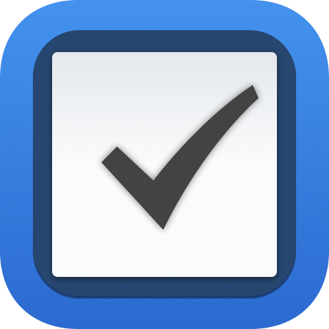
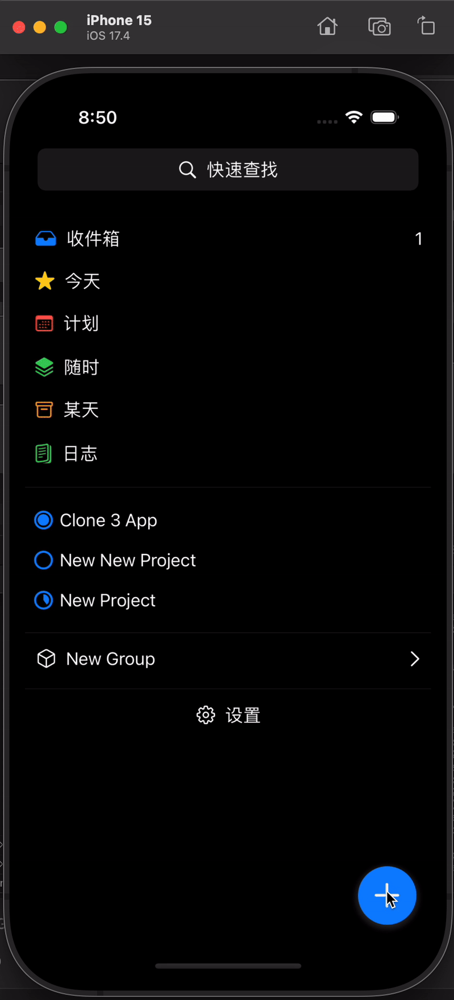

# CloneThings3

  

I wanted to learn how to build an app in SwiftUI. So I copied the [Things](https://culturedcode.com/things/) app. The app is built on CoreData

## Environment
- Minimum Deployment: 17.2
- XCode 14.0

## Learn
To learn more about how I built this app, you can take a look at *TODO*

## Release
Some notes on the releases

### Version 1
- CoreData entity to represent a single todo list task or project
- Task list items with checkbox, action swipe
- Project list items with progress pie chart
- Drag and drop version 1 - only rearange tasks, order not saved
- Search modal - redirect to task/project not yet implemented
- Date picker modal - only today, tonight, and specific date
- Inbox view
- Settings modal

  

### Version 2
To Be Released...
